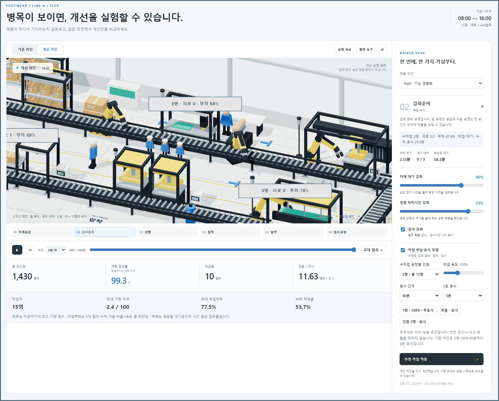
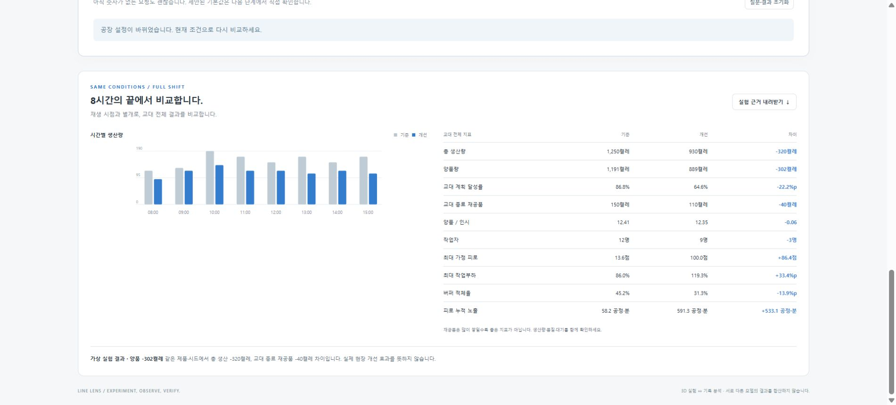
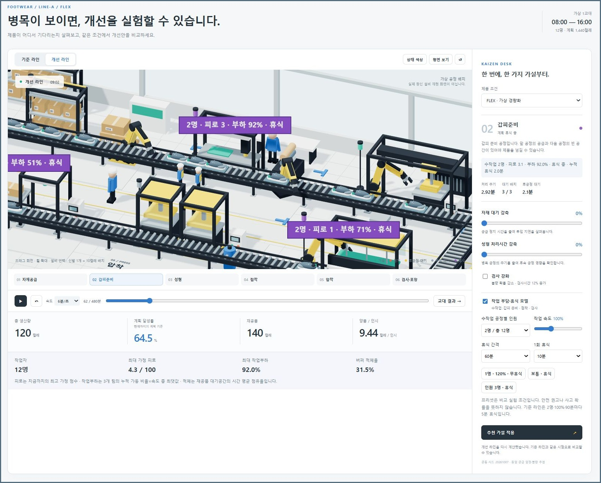

# Line Lens — Factory Playground

**생산라인을 직접 움직이며 병목을 관찰하고, 같은 조건에서 개선 가설을 비교하는 웹 실험실입니다.**

신발이 여섯 공정을 통과하는 3D 시뮬레이션에서 자재 대기·성형 시간·검사와 **수작업 인원·속도·휴식**을 바꿉니다. 원하는 생산 목표를 문장으로 말하면 로컬 AI가 목표를 정리하고, 계산기가 시험한 후보를 사용자가 비교·적용합니다. 별도 CSV 분석 화면에서는 시간별 생산 기록과 정지 원인을 살펴볼 수 있습니다.

**공고의 생산 데이터 분석·현장 개선활동 지원 업무를 위해 생산라인 비교 도구를 만들었습니다. AI Tool 활용 업무 지원을 위해, 목표를 해석하고 계산 근거를 확인한 뒤 사용자가 개선 조건을 선택하는 로컬 AI 기능을 추가했습니다.** 설계 배경은 [창신 공식 LEAN 직무 공고](https://csg.recruiter.co.kr/app/jobnotice/view?systemKindCode=MRS2&jobnoticeSn=267821)의 2026.10.07 확인 내용이며 현재 모집 여부를 뜻하지 않습니다.

> 가상 공정과 합성 데이터로 만든 독립 개인 프로젝트입니다. 창신의 실제 공장·실적을 재현하거나 회사와 협업·배포한 결과가 아닙니다. 김현태가 문제 방향과 기능을 요청하고 화면·설명을 검토했으며, Codex를 활용해 구현과 계산 검증을 진행했습니다.



화면은 **왼쪽 공정 흐름 → 오른쪽 입력 조건 → 아래 결과 지표** 순서로 읽습니다. 이 캡처는 빠른 후보를 직접 적용한 상태로, 자재 60%·성형 25% 감축, 검사 강화, 수작업 공정당 3명·총 15명입니다. 신발 아이콘 하나는 10켤레 배치입니다. [AI 입력·후보·교대 비교를 포함한 전체 화면](docs/screenshots/09-worker-factory-full.jpg)도 확인할 수 있습니다.

## 바로 실행하기

Git과 **Node.js 22 이상**을 준비합니다. 로컬 검수 버전은 Node.js **22.22.2**이며 npm 의존성은 별도로 설치하지 않아도 됩니다.

```bash
git clone https://github.com/Kimhyuntae9665/line-lens.git
cd line-lens
npm start
```

- 공장 실험실: [http://127.0.0.1:8765](http://127.0.0.1:8765)
- 생산 기록 분석: [http://127.0.0.1:8765/analysis/index.html](http://127.0.0.1:8765/analysis/index.html)
- 계산·응답 검증: 다른 터미널에서 `npm test`

`index.html`을 직접 열기보다 서버 주소로 접속하세요. 서버는 `127.0.0.1`에 바인딩하며 터미널에서 `Ctrl+C`로 종료합니다. 포트가 겹치면 PowerShell에서 `$env:PORT = '8770'`을 설정한 뒤 `npm start`를 실행하고 `http://127.0.0.1:8770`을 엽니다.

**수동 3D 실험과 CSV 분석은 모델 서버·로그인·API 키 없이 실행됩니다. AI 목표 조언에는 별도의 로컬 LLM 서버가 필요합니다.** 검수 모델은 CPU에서 실행한 `Qwen3-4B-Q4_K_M` GGUF입니다. 저장소에는 모델 가중치와 llama.cpp 실행 파일이 없으며 `npm start`가 모델을 자동 다운로드하지 않습니다. 처음 연결할 때는 [로컬 AI 설치·실행 안내](docs/local-ai-setup.md)를 따르세요.

Three.js·OrbitControls는 `vendor/`에 포함되어 CDN을 호출하지 않습니다. 3D 화면에는 WebGL 지원 브라우저가 필요합니다. 그래픽 초기화가 실패해도 계산·공정 선택·결과 비교는 사용할 수 있습니다.

## 먼저 수동으로 공장을 관찰하기

화면을 드래그해 회전하고 휠로 확대합니다. 설비나 아래 공정 버튼을 선택하면 오른쪽에서 **처리 주기·대기 배치·후공정 대기**를 확인합니다. `상태 색상`, `평면 보기`를 켜면 상태와 배치를 다른 방식으로 볼 수 있습니다.

시간 슬라이더·재생 속도로 8시간을 관찰합니다. `처음부터 재생`은 0분으로, 카메라의 `↺`는 초기 시야로 돌아갑니다. 제품은 가상 제품 `FLEX`와 `CORE` 중 선택합니다.

| 바꿀 입력 | 실제 계산에 반영되는 변화 |
|---|---|
| 자재 대기 감축 0~80% | 같은 공급 정지 일정에서 정지 길이를 줄임 |
| 성형 처리시간 감축 0~30% | 성형 공정의 배치 처리시간을 줄임 |
| 검사 강화 | 불량 기준 확률을 절반으로 낮추고 검사시간을 12% 늘림 |
| 수작업 공정당 1~3명 | 갑피준비·접착·검사 처리시간과 총 인원 변화 |
| 작업 속도 90~120% | 수작업 부분의 처리속도와 가상 피로 누적 변화 |
| 60·90·120분마다 0·5·10분 휴식 | 수작업 공정 처리 일시정지와 가상 피로 회복 |

처음에는 한 조건씩 바꾸어 비교하세요. `추천 가설 적용`은 자재 60%·성형 20%·검사 강화를 넣는 **고정 예시 버튼**입니다. 로컬 AI가 계산한 추천과는 별개입니다.

`기준 라인`과 `개선 라인`은 같은 제품·시드로 비교합니다. 화면의 기준 라인은 공정 개선을 끄고 수작업 공정당 2명·속도 100%·90분마다 5분 휴식으로 계산합니다. **AI 카드의 기준은 질문 당시 사용자 설정**이므로 두 기준의 조건을 확인하세요.

`교대 결과 →`는 480분 시점과 전체 비교표를 보여줍니다. 아래 차트와 표는 재생 시점과 별개로 교대 전체를 비교합니다. `실험 근거 내려받기`는 설정·지표·가정·시간별 실적과 AI 해석·비교·적용 후보 ID를 JSON으로 저장합니다.

## AI에게 목표를 말하고 후보 적용하기

예를 들어 “**직원들이 무리하지 않으면서 양품 1000켤레를 더 빨리 만들고 싶어**”라고 입력합니다.

1. **목표 말하기:** `AI에게 목표 해석 요청`을 누르면 실제 로컬 LLM이 문장을 목표 JSON으로 정리합니다.
2. **수치·제약 확인:** 서버가 원문 숫자와 고정 지시의 근거를 검사합니다. 미지정값은 시스템 기본값으로 표시하며 사용자가 목적·수량·양품률·변경 허용·고정 조건을 수정하고 확인합니다.
3. **계산과 후보 비교:** 같은 설정·시드이면 같은 결과를 내는 시뮬레이터가 126개 공정 설정, 작업자 변경을 허용하면 최대 504개 설정을 계산합니다. 제약을 통과한 안에서 `더 빠르게`, `더 적게 바꾸기`, `작업 부담 줄이기` 관점의 후보를 고릅니다.
4. **AI의 근거 선택:** 로컬 LLM이 제공된 후보 ID와 그 후보에 허용된 계산 근거 문장을 선택합니다. 카드의 생산 수치는 계산기 결과를 그대로 표시합니다.
5. **사용자 적용:** `이 후보를 3D 라인에 적용 ↑`을 누르면 입력값과 개선 라인이 바뀝니다. 해석·비교만으로는 공장 설정이 바뀌지 않으며 재생 시점은 유지합니다.


**질문 → AI가 이해한 목표 → 편집 가능한 확인값 → 계산 건수·시간 → 세 후보 카드 → 적용 버튼** 순서로 읽습니다. 원문에는 수량 1,000이 있지만 양품률·피로·부하 한도는 없어 기본값과 구분해 확인했습니다. 카드에서는 목표 도달 시간 다음에 추가 인원·양품/인시·부하를 함께 읽습니다. [공장과 교대 비교를 포함한 전체 화면](docs/screenshots/11-worker-ai-advisor-full.jpg)도 확인할 수 있습니다.

“좀 더 빨리 물량을 만들고 싶어”처럼 수량이 없으면 기본 목표 양품 **1,000켤레**·양품률 **95%**·공정 변경 **3개**·피로 **40**·부하 **90%**·작업자 변경 허용이 표시됩니다. 이는 사용자가 말한 수치나 안전 기준이 아닙니다. `8시간 양품량 최대화`로 목적을 바꾸거나 요소를 현재 값으로 고정할 수도 있습니다.

공정 격자는 **자재 9단계 × 성형 7단계 × 검사 2조건 = 126개**입니다. 작업자 조건은 현재 설정·인원 한 단계 추가·속도 10%p 감소·휴식 추가의 최대 네 프로필을 조합합니다. 중복 프로필은 제거하므로 항상 504개는 아닙니다. 작업자 모델을 끄거나 작업자 조건 변경을 허용하지 않으면 126개입니다. 작업자 모델을 끈 경우 세 번째 관점은 `품질 우선`입니다. 같은 안이 여러 관점에서 선택되면 카드도 중복 제거해 세 개보다 적을 수 있습니다.

**LLM은 생산량을 예측하거나 자유롭게 공장의 원인을 진단하지 않습니다.** 원문 숫자 검증도 의미 해석 전체의 정확성을 보증하지 않으므로 사용자 확인이 필요합니다. 자세한 흐름·제약·JSON 예시는 [AI 동작 설명](docs/ai-workflow.md), 개발용 필드와 오류 코드는 [API 문서](docs/advisor-api.md)에 있습니다.

## 실제 로컬 AI 실행에서 관찰한 결과

2026.10.09 **CPU·Qwen3-4B-Q4_K_M·FLEX·시드 20261007**에서 실행했습니다. 요청 당시 수작업 공정당 2명·속도 100%·90분마다 5분 휴식이고 사용자가 양품 1,000켤레·양품률 95%·공정 변경 최대 3개·피로 40·부하 90%·작업자 변경 허용을 확인했습니다.

**504개 중 288개가 전체 제약을 통과**했고 작업 부담 한도 제외 216개·품질 한도 제외 0개였습니다. 일반적으로 두 제외 집계는 중복될 수 있으므로 서로 다른 제외 건수처럼 합산하지 않습니다.

| 비교 | 목표 양품 도달 | 총 생산 / 양품 | 인원 | 최대 가정 피로 | 작업부하 지표 | 양품/인시 |
|---|---:|---:|---:|---:|---:|---:|
| 요청 당시 설정 | 409분 | 1,250 / 1,191 | 12명 | 13.6 | 86.0% | 12.41 |
| 더 빠르게: 자재 60%·성형 25%·검사 강화·인원 추가 | 345분 | 1,430 / 1,396 | 15명 | 2.4 | 77.5% | 11.63 |
| 더 적게 바꾸기: 검사 강화만 | 400분 | 1,250 / 1,225 | 12명 | 13.6 | 86.0% | 12.76 |
| 작업 부담 줄이기: 수작업 공정별 3명 | 407분 | 1,260 / 1,201 | 15명 | 1.3 | 68.7% | 10.01 |

빠른 후보는 목표 도달이 64분 빨라지지만 **인원 3명이 더 필요하고 양품/인시는 낮아집니다.** 총 생산 증가를 인건비 절감이나 실제 안전 개선 성과로 해석하지 않습니다.

| 처리 단계 | 한 번의 화면 관찰 |
|---|---:|
| 새 시뮬레이터 계산 | 4.86초 |
| 로컬 LLM 목표 해석 | 34.74초 |
| 로컬 LLM 후보·허용 근거 선택 | 63.32초 |
| 두 LLM 처리 시간 합계 | 98.06초 |

시간은 평균·보장 성능이 아닌 **한 번의 실제 실행 관찰**입니다. LLM 합계에는 시뮬레이터 계산과 사용자 확인 시간을 넣지 않았습니다. 화면은 계산·AI 해석·근거 선택 시간을 분리하며 계산 캐시를 재사용하면 `계산 캐시 사용`을 표시합니다. 캐시의 설정 수를 새 시뮬레이션 실행 수로 읽지 않습니다.

[실제 실행 근거 JSON](experiments/worker-ai-observed-run.json)과 위 캡처는 실제 LLM 연결 관찰 기록입니다. `npm run benchmark:advisor`는 같은 504개 설정의 **계산 지표만** 재현하고 `llmCalled:false`를 표시합니다. 이 명령과 자동 테스트의 모의 LLM 응답은 실제 모델 추론 성공·응답 시간을 재측정하는 검사가 아닙니다.

## 과부하와 휴식은 어떻게 보이나요?



이 캡처는 수작업 공정당 **1명·속도 120%·무휴식**을 적용한 교대 전체 결과입니다. **왼쪽 시간별 생산량 → 오른쪽 생산·양품·인원 → 피로·부하** 순서로 읽습니다. 총 9명인 이 조건은 총 생산 930·양품 889켤레, 최대 가정 피로 100·부하 119.3%였습니다. 입력 패널은 이 캡처 밖에 있으며, 여러 조건을 함께 바꾼 스트레스 시나리오이므로 속도 증가 하나의 효과라고 단정하지 않습니다.



**오른쪽 휴식 간격 60분·길이 10분 → 슬라이더 62분 → 보라색 공정 배지 → 선택 공정의 누적 휴식 2분**을 확인합니다. 휴식 중에는 세 수작업 공정의 처리가 멈추고 가상 피로가 회복됩니다. 다른 공정은 버퍼·공급 규칙대로 움직입니다. [휴식 실험 전체 화면](docs/screenshots/12-worker-rest-full.jpg)에서는 62분의 상태와 8시간 전체 결과가 다른 범위임을 함께 확인할 수 있습니다.

**피로와 부하는 교육용 가정 지표입니다.** 피로는 과거 최고값과 현재값을 구분하며 작업부하는 속도 가중 누적 가동률로 100%를 넘을 수 있습니다. 버퍼 적체율은 재공품 대기공간 점유이며 사람·차량 동선 위험이 아닙니다. 사고확률·안전 인증·실측 건강 상태를 계산하거나 현장 데이터로 보정한 디지털 트윈으로 표시하지 않습니다. 식·계수·현장 보정 범위는 [작업자 모델 설명](docs/human-factors-model.md)에 있습니다.

## 연결 실패·잘못된 응답·후보 없음

| 상황 | 화면과 사용자가 할 일 |
|---|---|
| 모델 미연결·시간 초과 | 오류 표시 후 AI 요청 중단. 모델 서버와 주소 확인. 수동 기능은 계속 사용 가능. |
| 잘못된 JSON·허용되지 않은 후보/근거 | AI 응답을 오류로 거부. 모델·서버의 구조화 응답 지원 확인. |
| 제약 통과 후보 0건 | 후보 없음 표시, LLM 근거 선택 미실행. 목표나 제약을 직접 수정. |
| 공장 입력값 변경 | 이전 비교 결과를 지우고 현재 조건으로 다시 비교. |
| 질문·결과 초기화 | 질문과 AI 결과를 지우며 현재 공장 설정 유지. |

규칙 기반 문장을 LLM 응답처럼 대신 만들어 성공 처리하지 않습니다. 개발 중 작은 모델이 원문에 없는 숫자와 근거 없는 이유를 만드는 사례가 있어, 현재는 원문 숫자·고정 조건 근거와 후보별 허용 문장을 검증합니다. 연결·추론 오류를 구분하는 방법은 [실행 안내](docs/local-ai-setup.md)에 있습니다.

## 별도 도구: CSV 생산 손실 분석


기본 표본은 **3개 가상 라인 × 10일 × 8시간 = 240행**의 합성 CSV입니다. **필터 → 시간대 막대 → 정지 원인 Pareto → 감축 가정 → 비교 지표** 순서로 읽습니다. `LINE-A`·`FLEX`로 범위를 좁히고 `비교 범위 잠금`을 켜면 같은 범위에서 가정을 비교할 수 있습니다.

`CSV 불러오기`의 사용자 파일은 `USER_IMPORTED_UNVERIFIED`로 표시합니다. 형식 검사가 실제 기록임을 인증하는 것은 아닙니다. 잘못된 파일은 전체 거부하고 기존 데이터·조건을 보존합니다. `초기화`는 합성 표본과 기본 조건을 복원합니다.

`검토 보고서 .md`, `전체 근거 .json`, `AI 검토 프롬프트 .txt`를 내려받을 수 있습니다. **CSV 화면은 LLM을 자동 호출하지 않으며** 프롬프트는 별도 검토용 텍스트입니다. 필수 열·검증 규칙은 [분석 도구 설명](analysis/README.md)을 읽으세요.

## 계산 범위와 재현

3D 모델은 **1초 간격·6공정 직렬 FIFO·공정당 3배치 대기공간·초기 재공품 0**을 사용합니다. 배치는 10켤레입니다. 공정 시간·정지·불량 확률은 가정이고 같은 제품·시드로 기준과 개선의 품질 추첨 조건을 맞춥니다. 목표 도달은 1분 단위로 관찰합니다. 병렬 설비·제품 혼합·재작업·비용·에너지·사고확률은 구현 범위 밖입니다.

| 작업자 모델을 끈 재현 실험 | 총 생산 / 양품 | 종료 재공품 |
|---|---:|---:|
| 기준 | 1,250 / 1,191 | 150 |
| 자재 대기만 60% 감축 | 1,250 / 1,191 | 150 |
| 성형 시간만 20% 감축 | 1,400 / 1,332 | 40 |
| 검사 강화만 | 1,250 / 1,225 | 150 |
| 세 조건 함께 | 1,420 / 1,388 | 20 |

공통 조건은 FLEX·시드 20261007·480분·12명·계획 1,440켤레입니다. `node experiments/factor-comparison.mjs`로 [다섯 실험 JSON](experiments/factor-results.json)을 다시 생성합니다. 이 조건에서는 자재 대기를 줄여도 성형 병목이 남아 총 생산량이 늘지 않습니다. 새 작업자 모델의 AI 표와 구분하세요.

CSV는 합계 기준 KPI·Pareto, 회복한 시간에 기존 가동 중 평균 속도로 생산하는 `SIMULATED` 기대값을 계산합니다. 추가 생산은 해당 행의 계획 미달분을 넘지 않습니다. 3D 시간을 CSV로 추정하지 않았고 두 모델 결과를 합산하지 않습니다. OEE도 계산하지 않습니다.

현재 화면의 계획 달성률은 현재까지의 선형 계획, 교대 표는 전체 계획 1,440켤레가 분모입니다. 양품/인시는 **양품 ÷ (실제 총 인원 × 휴식 포함 경과 시간)** 입니다. 재공품은 공급했으나 완료하지 못한 켤레이며 공정별 대기·막힘·정지는 서로 겹칠 수 있습니다.

## 코드와 검증

| 경로 | 역할 |
|---|---|
| [`simulation.js`](simulation.js) | 공급·처리·정지·막힘·품질·작업자·휴식 계산 |
| [`scene.js`](scene.js), [`app.js`](app.js) | 3D 표시, 설비 선택, 재생·입력·비교·근거 내보내기 |
| [`advisor-engine.js`](advisor-engine.js) | 최대 504개 계산, 제약 필터, 후보 분류·순위 |
| [`advisor-service.js`](advisor-service.js), [`advisor-ui.js`](advisor-ui.js) | 실제 LLM 요청·응답 검증, 사용자 확인·적용 |
| [`analysis/engine.js`](analysis/engine.js) | CSV 검증·필터·KPI·Pareto·보고서 |
| [`serve.mjs`](serve.mjs), [`vendor/`](vendor/) | 로컬 서버와 포함된 그래픽 라이브러리 |
| [`tests/`](tests/), [`analysis/tests/`](analysis/tests/) | Node 기본 테스트 러너를 사용하는 검증 |

2026.10.09 최종 검수에서 `npm test`의 **40개 테스트가 통과**했습니다. 수량 보존·버퍼 한도·결정성·불변 스냅샷·잘못된 입력 거부·CSV 분모와 시나리오 상한, 휴식 중 정지·회복·인시, 프로필·캐시·제약 분리와 AI 목표 확인·후보/근거·잘못된 응답 객체 검증을 다룹니다. 모의 LLM 응답 테스트와 실제 CPU 모델 실행 관찰을 구분합니다. 통과는 현장 모델 타당성이나 모든 문장의 해석 정확성을 증명하지 않습니다. [검수 기록](docs/verification.md)에서 관찰별 실행 조건과 범위를 확인할 수 있습니다.

## 설계에 참고한 공개 자료

최초 설계 기준일은 **2026.10.07**, 로컬 AI·작업자 모델 검수일은 **2026.10.09**입니다.

- [창신 공식 LEAN 직무 공고](https://csg.recruiter.co.kr/app/jobnotice/view?systemKindCode=MRS2&jobnoticeSn=267821): 생산 데이터 분석·개선활동·AI Tool 활용 업무와 설계 연결.
- [창신 2021 지속가능경영보고서](https://www.changshininc.com/pdf/2021%20Changshin_Sustainability%20Report_KOR.pdf): CPS·Kaizen·시각 관리·시간별 실적의 과거 공개 설명. 현재 운영 상태의 증거는 아닙니다.
- [DDI 공개 사례](https://www.doosandigitalinnovation.com/kr/promotion/insight/82?param1=ALL): 창신INC 예지정비·클라우드 사례 참고. 해당 시스템 연동·예지정비 모델은 구현하지 않았습니다.
- [산업 모형 그래픽 참고 게시물](https://x.com/ihorbeaver/status/2107210345051988131): 표현 참고. 영상·이미지·모델 파일을 복사하지 않고 모형을 코드로 제작했습니다.
- [Qwen3-4B 공식 모델 카드](https://huggingface.co/Qwen/Qwen3-4B), [공식 GGUF 배포 페이지](https://huggingface.co/Qwen/Qwen3-4B-GGUF), [llama.cpp 서버 문서](https://github.com/ggml-org/llama.cpp/tree/master/tools/server): 모델·구조화 응답·서버 설정 참고.

Three.js **0.186.1**과 OrbitControls의 MIT 고지는 [`vendor/LICENSE`](vendor/LICENSE)에 있습니다. 외부 로봇·인물·신발 모델 자산은 포함하지 않았습니다. 모델·실행 파일의 별도 이용 조건은 각 배포처에서 확인합니다.
