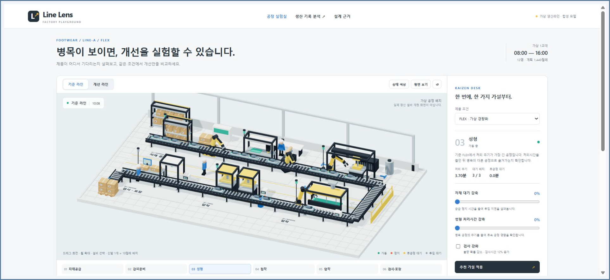
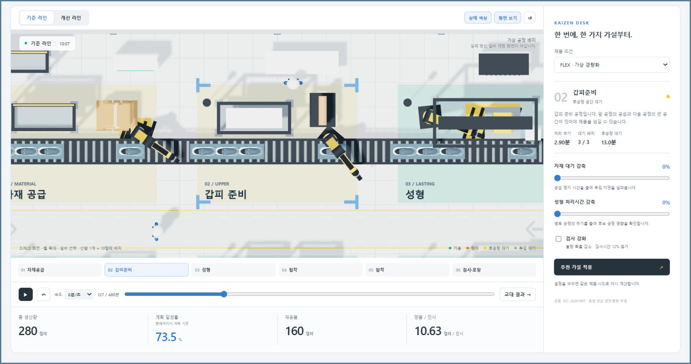
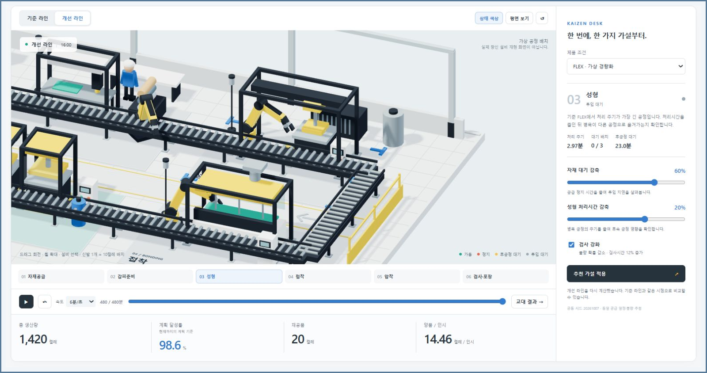
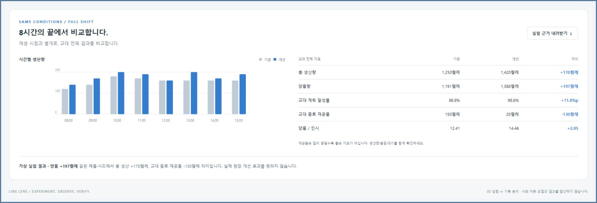
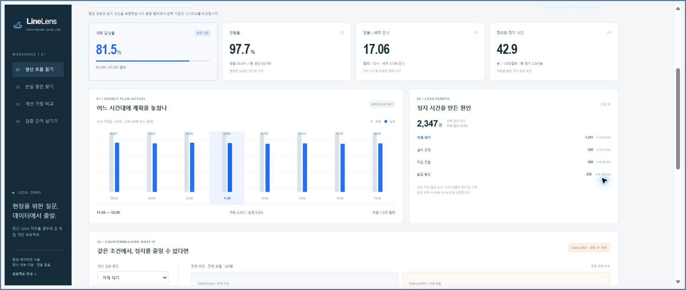
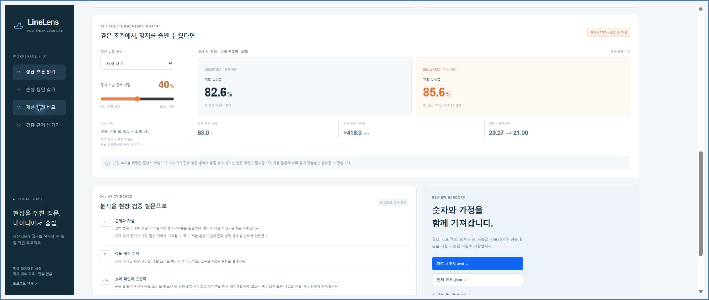

# Line Lens — Factory Playground

**생산라인을 직접 움직이며 병목을 관찰하고, 같은 조건에서 개선 가설을 비교하는 웹 실험실입니다.**

신발이 여섯 공정을 통과하는 3D 시뮬레이션과 시간별 CSV 생산 기록 분석을 제공합니다. 자재 대기, 성형 처리시간, 검사 조건을 바꾸면 생산량·양품·재공품이 다시 계산됩니다. 숫자가 좋아졌는지뿐 아니라, 어떤 가정 때문에 바뀌었는지 확인하고 검증 근거를 파일로 남길 수 있습니다.

> 가상 생산라인과 합성 데이터로 만든 독립 개인 프로젝트입니다. 창신의 실제 공장·설비·생산 실적을 재현하지 않으며, 회사 공식 제품이나 협업 프로젝트가 아닙니다. 김현태의 요청과 검토 아래 Codex를 활용해 코드·화면·검증을 함께 구현했습니다.



*공장 실험실: 공정 흐름, 재생 시점, 생산 지표와 개선 설정을 한 화면에서 살펴봅니다. 신발 아이콘 하나는 10켤레 배치입니다.*

## 바로 실행하기

Node.js 22 이상과 Git이 설치된 환경에서 다음 명령을 실행합니다. Node.js 22.22.2에서 실행·테스트를 확인했으며, 별도로 설치할 npm 의존성은 없습니다.

```bash
git clone https://github.com/Kimhyuntae9665/line-lens.git
cd line-lens
npm start
```

- 공장 실험실: [http://127.0.0.1:8765](http://127.0.0.1:8765)
- 생산 기록 분석: [http://127.0.0.1:8765/analysis/index.html](http://127.0.0.1:8765/analysis/index.html)
- 계산 테스트: `npm test`

서버는 `127.0.0.1`에만 바인딩합니다. 다른 포트가 필요하면 PowerShell에서 `$env:PORT = '8768'`을 설정한 뒤 `npm start`를 실행합니다. `index.html`을 직접 여는 대신 서버 주소로 접속해야 ES 모듈을 사용할 수 있습니다.

Three.js와 OrbitControls는 `vendor/`에 포함되어 있습니다. 실행 중 CDN·외부 API·로그인·API 키가 필요하지 않습니다. 3D 화면에는 WebGL을 지원하는 브라우저가 필요하며, 그래픽 초기화에 실패해도 계산·공정 선택·결과 비교는 사용할 수 있습니다.

## 3D 생산라인에서 해볼 일

### 1. 제품이 기다리는 곳 찾기

화면을 드래그하면 공장을 회전하고, 휠로 확대할 수 있습니다. 설비를 클릭하거나 화면 아래의 공정 버튼을 선택하면 오른쪽에 **처리 주기·대기 배치·후공정 대기**가 표시됩니다. `상태 색상`과 `평면 보기`를 켜면 각 공정의 상태와 배치를 다른 방식으로 확인할 수 있습니다.

시간 슬라이더를 움직여 같은 시점을 다시 보거나, 재생 버튼과 속도 선택으로 8시간의 흐름을 따라갑니다. `처음부터 재생`은 시점을 0분으로 되돌립니다. 카메라의 `↺` 버튼은 시야를 초기화합니다.



*공정 선택: 평면 보기에서 갑피준비의 후공정 공간 대기와 3/3 대기 배치를 확인합니다. 다음 성형 공정의 처리 주기가 가장 길게 설정된 기준 FLEX를 관찰한 화면입니다.*

### 2. 한 가지 가정부터 바꾸기

`제품 조건`에서 가상 제품 `FLEX` 또는 `CORE`를 선택합니다. 다음 세 조건을 조절하면 **같은 제품·시드의 기준 라인과 개선 라인**을 다시 계산합니다.

| 조작 | 계산에 반영되는 변화 |
|---|---|
| `자재 대기 감축` 0~80% | 같은 자재 공급 정지 일정에서 정지 길이를 줄임 |
| `성형 처리시간 감축` 0~30% | 성형 공정의 배치 처리시간을 줄임 |
| `검사 강화` | 불량 기준 확률을 절반으로 낮추고 검사시간을 12% 늘림 |

`기준 라인`과 `개선 라인`을 전환해 같은 시점의 상태를 비교하세요. `추천 가설 적용`은 자재 대기 60%, 성형 처리시간 20%, 검사 강화를 함께 적용하는 **예시 설정**입니다. 최적화 알고리즘이 찾아낸 해답은 아닙니다.



*개선 설정: 입력을 바꾸면 실제 계산 결과가 바뀝니다. 먼저 한 조건씩 비교한 뒤 여러 가정을 함께 적용하면 각 변화의 역할을 구분하기 쉽습니다.*

### 3. 교대 전체 결과와 근거 확인하기

`교대 결과 →`를 누르면 480분 시점으로 이동하고 전체 비교표를 보여줍니다. 표와 시간별 생산 차트는 재생 중인 시점과 별개로 **교대 전체**를 비교합니다. `실험 근거 내려받기`는 설정, 지표 정의, 가정, 기준·개선 결과, 시간별 실적과 현장 확인 질문을 JSON으로 저장합니다.



*교대 비교: 총 생산량만 보지 않고 양품량, 종료 재공품, 양품/인시를 함께 확인합니다. 표시된 변화는 가상 모델의 계산 결과입니다.*

## 같은 조건으로 재현한 다섯 실험

공통 조건은 **FLEX · 시드 20261007 · 480분 · 12명 · 계획 1,440켤레**입니다. 초기 재공품은 0이며, 공정 시간·정지 일정·불량 확률은 가정으로 설정했습니다.

| 실험 조건 | 총 생산량 (켤레) | 양품량 (켤레) | 종료 재공품 (켤레) |
|---|---:|---:|---:|
| 기준 | 1,250 | 1,191 | 150 |
| 자재 대기만 60% 감축 | 1,250 | 1,191 | 150 |
| 성형 처리시간만 20% 감축 | 1,400 | 1,332 | 40 |
| 검사 강화만 적용 | 1,250 | 1,225 | 150 |
| 세 가정 함께 적용 | 1,420 | 1,388 | 20 |

이 조건에서는 자재 대기를 줄여도 성형 병목이 남아 총 생산량이 늘지 않습니다. 성형 시간을 줄이면 생산량이 늘고 종료 재공품이 줄어듭니다. 검사 강화만 적용하면 총 생산량은 같지만 양품량이 달라집니다. **가장 큰 정지 항목을 줄이는 것과 생산량을 늘리는 것이 항상 같지는 않다**는 모델 내 비교입니다. 실제 공장 개선 효과나 통계적 유의성을 입증하는 결과는 아닙니다.

결과를 다시 생성하려면 저장소 루트에서 실행합니다.

```bash
node experiments/factor-comparison.mjs
```

설정과 전체 결과는 [`experiments/factor-results.json`](experiments/factor-results.json)에 기록됩니다. 기준과 개선은 배치·켤레별 동일한 난수 추첨을 사용하므로, 작업 순서나 완료 시점이 달라져도 같은 제품의 불량 조건을 비교할 수 있습니다.

## 별도 도구: CSV 생산 손실 분석

상단의 `생산 기록 분석 ↗`을 열면 시간별 계획·실적과 정지 원인을 분석하는 화면으로 이동합니다. 기본 표본은 **3개 가상 라인 × 10개 작업일 × 8시간 = 240행**의 합성 CSV입니다.

시간대 막대를 선택해 계획 미달을 확인하고, Pareto에서 정지 원인별 기여도와 누적 비율을 살펴봅니다. `개선 검토 원인`과 `정지 시간 감축 가정`을 바꾸면 관측 기준과 `SIMULATED` 기대값을 같은 표본으로 비교합니다.



*기록 분석: 시간별 막대는 선택한 여러 작업일·라인의 동일 시간대를 합산합니다. 단일 실시간 교대 화면으로 해석하지 않습니다.*

`생산 라인`을 `LINE-A`, `제품 모델`을 `FLEX`로 바꾸고 `비교 범위 잠금`을 켜보세요. 물량과 분모가 달라지는 것을 확인한 뒤 동일한 범위에서 가정을 비교할 수 있습니다. `검토 보고서 .md`, `전체 근거 .json`, `AI 검토 프롬프트 .txt`에는 필터·계산 정의·표본 지문·가정·검증 질문이 함께 담깁니다.



*필터 비교: 전체 제품 혼합 집계와 특정 라인·제품의 결과를 구분합니다. 화면의 잠금은 비교 범위를 고정하는 기능입니다.*

`CSV 불러오기`로 사용자 파일도 분석할 수 있습니다. 업로드는 `USER_IMPORTED_UNVERIFIED`로 표시되며, 형식 검사를 통과했다고 실제 데이터임이 확인되는 것은 아닙니다. 잘못된 파일은 전체를 거부하고 기존 데이터와 조건을 보존합니다. `초기화`는 합성 표본과 기본 분석 조건을 복원합니다. 필수 열·검증 규칙·계산식은 [분석 도구 설명](analysis/README.md)에서 확인할 수 있습니다.

## 두 계산 모델의 범위

| 구분 | 3D 공장 실험 | CSV 기록 분석 |
|---|---|---|
| 입력 | 가정한 공정 시간·정지·불량과 개선 설정 | 시간별 계획·생산·양품·인원·정지 기록 |
| 계산 | 1초 간격의 6공정 직렬 FIFO, 공정별 대기공간 3배치 | 합계 기준 KPI, 필터, Pareto, 회복 시간의 생산 기대값 |
| 다루는 질문 | 병목이 어디로 이동하고 재공품이 어떻게 바뀌는가 | 어느 범위·원인부터 현장에서 확인할 것인가 |
| 주요 한계 | 병렬 설비·제품 혼합·재작업·실제 현장 조건 미반영 | 전후 공정 병목·재공품·품질 변화·수요 제약 미반영 |

**3D 공정 시간은 CSV로 추정하지 않았으며 두 모델의 결과를 합산하지 않습니다.** 실제 적용에는 공정 흐름, 주기, 공급, 버퍼, 품질과 교대 기록을 수집해 모델을 보정하고 같은 조건에서 재측정해야 합니다.

실행 중 LLM·AI 예측·외부 API 호출은 없습니다. AI 검토 프롬프트는 사용자가 근거를 다른 검토 도구에 전달할 수 있도록 만드는 텍스트 파일이며 자동 실행되지 않습니다.

## 용어와 지표 읽기

| 용어 | 이 프로젝트에서의 의미 |
|---|---|
| 배치 | 함께 이동하는 10켤레 묶음 |
| FIFO | 먼저 들어온 배치부터 처리하는 순서 |
| 시드 | 난수 생성 조건. 같은 값으로 실행해 기준·개선의 추첨 조건을 맞춤 |
| 병목 | 다른 공정의 흐름을 제한하는 처리 구간 |
| 재공품 | 공급했지만 아직 완료되지 않은 켤레. 대기·처리·완료 후 막힘 포함 |
| 막힘 / 투입 대기 | 다음 버퍼가 차서 넘기지 못함 / 처리할 배치가 없음 |
| 인시 | 인원 × 시간. 12명이 8시간 배치되면 96인시 |
| Pareto | 정지 원인을 기여도가 큰 순서로 정렬하고 누적 비중을 표시한 차트 |

3D 화면의 계획 달성률은 **현재까지의 선형 계획**, 교대 비교는 **전체 계획 1,440켤레**가 분모입니다. 양품/인시는 정지 시간을 포함한 경과 시간과 12명을 사용합니다. 분모가 0이면 `—`이며, 경과 시간이 있지만 생산이 0이면 `0`입니다. 공정별 정지·막힘·대기 시간은 서로 겹칠 수 있어, 합계를 라인 전체 정지시간으로 해석하지 않습니다.

CSV 지표는 행별 비율의 평균 대신 합계로 계산합니다. 회복 시간에 기존 행의 가동 중 평균 속도로 생산한다고 가정하며, 추가 생산은 해당 행의 계획 미달분을 넘지 않습니다. 분수 켤레는 기대값입니다. 설비의 기준속도가 없으므로 OEE를 계산했다고 주장하지 않습니다.

## 구성과 검증

| 경로 | 역할 |
|---|---|
| [`simulation.js`](simulation.js) | 공급·처리·정지·막힘·품질·스냅샷 계산 |
| [`scene.js`](scene.js) | Three.js 공장 모형, 설비 선택, 카메라와 상태 표시 |
| [`app.js`](app.js), [`index.html`](index.html), [`styles.css`](styles.css) | 재생, 개선 설정, 비교, 근거 내보내기 |
| [`analysis/engine.js`](analysis/engine.js) | CSV 파싱·검증, 필터, KPI, Pareto, 기대값과 보고서 생성 |
| [`analysis/sample.csv`](analysis/sample.csv), [`analysis/sample.js`](analysis/sample.js) | 합성 표본과 생성 규칙 |
| [`experiments/`](experiments/) | 다섯 조건 비교와 결과 JSON |
| [`tests/`](tests/), [`analysis/tests/`](analysis/tests/) | Node 기본 테스트 러너를 사용하는 계산 검증 |
| [`serve.mjs`](serve.mjs), [`vendor/`](vendor/) | 로컬 서버와 포함된 그래픽 라이브러리 |

```bash
npm test
```

총 18개 테스트(시뮬레이션 7개·기록 분석 11개)는 수량 보존(`공급량 = 완료량 + 재공품`), 버퍼 한도, 배치 ID 고유성, 양품·불량 관계, 결정성, 불변 스냅샷, 0분·0생산, 잘못된 설정과 CSV 거부, 필터·분모·시나리오 상한·재현성을 확인합니다. 자동 테스트의 통과는 실제 제조 현장의 모델 타당성을 증명하지 않습니다.

## 설계에 참고한 공개 자료

제작·참고 기준일은 **2026.10.07**입니다. 다음 자료는 업무 흐름을 이해하고 기능을 선택하는 데 참고했습니다. 채용 공고 링크는 당시 설계 배경이며 현재 모집 여부를 뜻하지 않습니다.

- [창신 공식 LEAN 직무 공고](https://csg.recruiter.co.kr/app/jobnotice/view?systemKindCode=MRS2&jobnoticeSn=267821): 생산 분석·KPI·현장 개선과 검증 근거를 연결하는 설계 배경.
- [창신 2021 지속가능경영보고서](https://www.changshininc.com/pdf/2021%20Changshin_Sustainability%20Report_KOR.pdf): CPS·Kaizen·시각 관리·GMES 시간별 실적 관리의 과거 공개 설명. 2021년 자료이며 현재 운영 상태의 증거로 사용하지 않습니다.
- [DDI 공개 사례, 2026.09.17](https://www.doosandigitalinnovation.com/kr/promotion/insight/82?param1=ALL): 창신INC의 글로벌 예지정비 서비스와 클라우드 운영 사례. 해당 시스템과의 연동이나 예지정비 모델은 구현하지 않았습니다.
- [산업 모형 그래픽 참고 게시물](https://x.com/ihorbeaver/status/2107210345051988131): 격자 바닥·설비 프레임·로봇·컨베이어의 시각적 표현 참고. 원본 영상·이미지·모델 파일을 복사하지 않았으며 공장 모형은 코드로 제작했습니다.

Three.js **0.186.1**과 OrbitControls는 공식 npm 배포본을 포함했고 [공식 문서](https://threejs.org/docs/)를 참고했습니다. 라이브러리의 MIT 고지는 [`vendor/LICENSE`](vendor/LICENSE)에 유지합니다. 외부 로봇·인물·신발 모델 자산은 포함하지 않았습니다.
