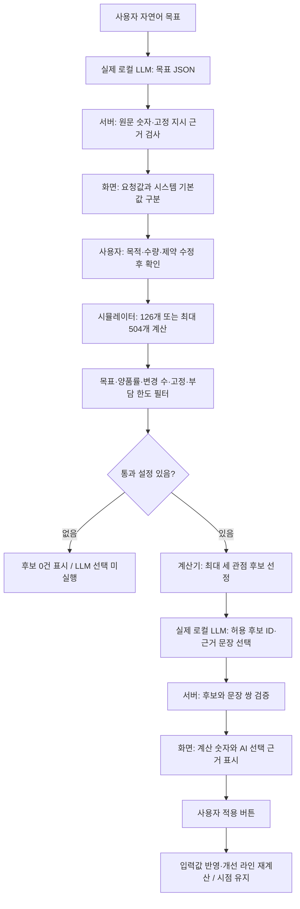
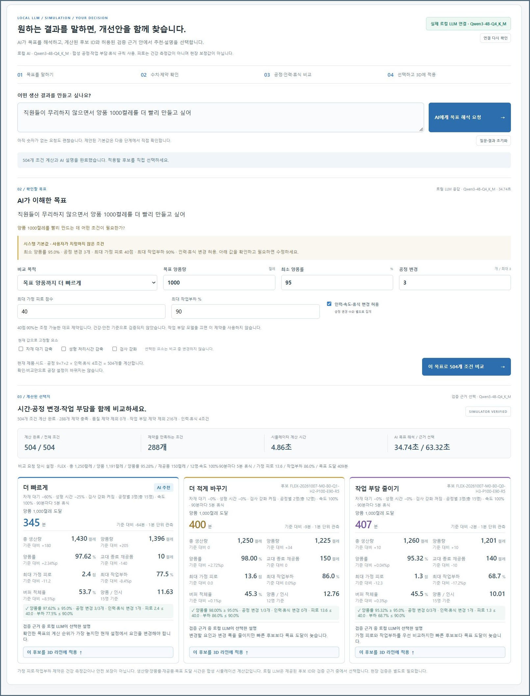

# AI 목표 조언은 어떻게 작동하나요?

Line Lens에서는 **로컬 LLM이 문장을 해석하고, 규칙에 따라 계산하는 시뮬레이터가 숫자를 만들고, 사용자가 조건과 적용을 결정합니다.** 이 문서는 화면의 한 요청이 어떤 단계를 통과하는지 설명합니다. 실행 준비는 [로컬 AI 설정](local-ai-setup.md), 개발용 필드는 [API 문서](advisor-api.md), 인력·휴식 계산식은 [작업자 모델](human-factors-model.md)을 읽으세요.

공고의 AI Tool 활용·현장 개선활동 지원 업무를 위해, 목표를 수치와 제약으로 확인하고 계산된 개선 후보를 비교하는 기능을 만들었습니다. 업무 연결은 [README의 공식 공고 출처와 제작 범위](../README.md)를 따릅니다. 회사 시스템 연동이나 실제 생산 의사결정 자동화가 아닌 개인 가상 실험 도구입니다.

## 한 요청의 전체 흐름



통과 설정이 있는 정상 경로에서는 LLM을 **두 번** 호출합니다. 목표 JSON 해석과 계산 후 후보·근거 선택입니다. 상태 확인의 `/models` 호출은 추론 요청이 아닙니다. 모델 응답이 실패하면 해당 단계를 오류로 끝내며, 대체 규칙을 AI 응답처럼 표시하지 않습니다.

## 1. 사용자 문장을 목표 JSON으로 정리

`AI 목표 조언`에 다음 문장을 입력하고 `AI에게 목표 해석 요청`을 누릅니다.

> 직원들이 무리하지 않으면서 양품 1000켤레를 더 빨리 만들고 싶어

브라우저는 Line Lens의 `POST /api/advisor/interpret`로 목표 문장을 보냅니다. 서버는 로컬 모델의 `POST /v1/chat/completions`를 호출하며 JSON Schema 형식의 답을 요청합니다. 해석용 모델 입력에는 **사용자 문장만** 전달합니다. 현재 공장 설정을 사용자가 요청한 제약으로 오인하지 않도록 해석 프롬프트에 넣지 않습니다.

아래는 필드 이해를 위한 **예시 JSON**입니다. 특정 실행의 모델 원본 응답을 그대로 복사한 값은 아닙니다.

```json
{
  "objective": "reach_target",
  "targetGoodPairs": 1000,
  "minQualityPct": null,
  "maxChangedFactors": null,
  "maxFatigueScore": null,
  "maxWorkloadPct": null,
  "allowHumanChanges": null,
  "locks": {
    "materialReduction": null,
    "balanceReduction": null,
    "qualityGuard": null
  },
  "interpretation": "양품 1000켤레를 더 빨리 만들고 작업자 부담도 함께 비교합니다.",
  "questions": ["목표와 비교 한도를 확인해 주세요."]
}
```

`null`은 사용자 문장에서 해당 값을 정하지 않았다는 의미입니다. “무리하지 않게”라는 표현만으로 특정 피로·부하 수치를 만들거나 인원 증원을 확정하지 않습니다.

| 목표 구분 | 의미 |
|---|---|
| `reach_target` | 지정한 양품량에 도달하는 시간을 비교 |
| `maximize_good` | 8시간 교대의 양품량을 비교 |
| `clarify` | “빨리”, “부담 줄이기”처럼 구체적 생산 목표가 모호해 확인 필요 |
| `unsupported` | 비용·실제 사고확률 등 현재 모델이 계산하지 않는 목표 |

지원하지 않는 요청은 `goal:null`로 반환해 비교를 진행하지 않습니다. 모델의 문장 해석이 틀릴 수 있으므로 해석된 목적도 화면에서 확인합니다.

## 2. 원문 근거 검사와 사용자 확인

[`advisor-service.js`](../advisor-service.js)는 모델 응답을 그대로 요청 조건으로 믿지 않습니다.

- 수량·양품률·변경 수·피로·부하 값이 유한한 숫자인지 확인합니다. 원문에서 쉼표를 제거해 추출한 숫자와 맞지 않으면 해당 값을 `null`로 되돌립니다.
- 피로·부하 한도에는 각각 관련 단어가 있어야 합니다. 고정 조건은 “고정”, “바꾸지”, “유지” 등의 지시와 해당 공정 이름을 함께 확인합니다.
- 인력·속도·휴식 변경 허용/금지는 관련 대상과 명시적 변경 지시의 근거를 검사합니다.
- 제거한 해석에는 `groundingWarnings`를 기록합니다. 사용자 요청값은 `requestedGoal`, 별도 기본값은 `defaultsApplied`로 구분합니다.

이 검사는 **원문 근거가 부족한 값을 걸러내는 제한된 검사**입니다. 원문에 1,000과 95가 모두 있어도 모델이 두 숫자의 의미를 잘못 연결하는 모든 경우를 잡지는 못합니다. “천 켤레”처럼 한글 수사도 숫자로 직접 대조되지 않을 수 있습니다. 확인란에서 의미와 값을 다시 읽고 수정해야 합니다.

| 시스템 기본값 | 초기 확인값 |
|---|---:|
| 비교 목적 | 목표 양품 도달을 더 빠르게 |
| 목표 양품량 | 1,000켤레 |
| 최소 양품률 | 95% |
| 변경 가능한 공정 요인 | 최대 3개 |
| 최대 가정 피로 | 40점 |
| 최대 작업부하 | 90% |
| 인력·속도·휴식 변경 | 허용 |
| 고정할 생산 요인 | 없음 |

기본값은 사용자 의사나 산업 안전 기준이 아닙니다. `8시간 양품량 최대화`에서는 목표 수량을 사용하지 않습니다. 비교 버튼은 사용자가 확인한 조건에 `confirmed:true`를 붙여 `POST /api/advisor/recommend`로 보냅니다. 확인 없이 계산을 요청하면 서버가 거부합니다.

## 3. 최대 504개 조건을 실제로 계산

[`advisor-engine.js`](../advisor-engine.js)의 `evaluateRecommendations()`는 LLM을 호출하지 않습니다. [`simulation.js`](../simulation.js)의 공정·품질·작업자 규칙으로 설정마다 8시간을 계산합니다. 같은 입력·시드이면 같은 결과를 내는 방식이며 이를 결정성(determinism)이라고 합니다.

공정 검색 범위는 자재 대기 감축 **0~80%를 10% 간격**, 성형 처리시간 감축 **0~30%를 5% 간격**, 검사 강화 **꺼짐/켜짐**입니다. `9 × 7 × 2 = 126`개이며 연속 범위 전체의 최적해를 검색하는 것은 아닙니다.

작업자 모델과 변경 허용을 모두 켜면 각 공정 설정에 아래 프로필을 조합합니다.

| 작업자 프로필 | 현재 설정에서의 변경 |
|---|---|
| 현재 | 그대로 |
| 인원 추가 | 수작업 공정마다 1명 추가, 최대 3명 |
| 속도 감소 | 속도 10%p 감소, 최소 90% |
| 휴식 추가 | 1회 휴식 5분 추가, 최대 10분; 간격은 현재값과 90분 중 작은 값 |

각 프로필은 현재값에서 만든 **별도 비교안**입니다. 인원·속도·휴식 변경 세 가지를 모두 결합한 모든 조합을 검색하지 않습니다. 동일 프로필은 제거하므로 `126 × 1~4개`, 최대 504개입니다. 작업자 모델을 끄거나 작업자 변경을 금지하면 현재 프로필 하나로 126개입니다.

제품·시드·모델 사용 여부·전체 작업자 프로필이 같은 격자는 서버 메모리 캐시로 재사용할 수 있습니다. 목표·제약이 바뀌면 저장된 계산에서 다시 필터·순위를 구합니다. 캐시 사용 시 504개를 비교해도 새 시뮬레이션을 504번 실행한 것은 아닙니다. 최대 네 격자를 보관하며 서버를 종료하면 사라집니다.

## 4. 제약을 통과한 안에서 관점별 후보 선정

모든 후보는 양품률·목표 도달·공정 변경 수·고정 조건을 만족해야 합니다. 작업자 모델을 켰으면 가정 피로와 작업부하 한도도 적용합니다. **공정 변경 최대 3개는 자재·성형·검사에만 적용**되며 인력·속도·휴식 변경 허용과 별개입니다. 고정 조건은 그 생산 요인을 질문 당시 값으로 유지하게 합니다.

| 카드 | 계산기가 고르는 기준 |
|---|---|
| 더 빠르게 | 목표 도달 시간이 가장 빠름; 최대화 목적이면 교대 양품량이 가장 큼 |
| 더 적게 바꾸기 | 기준보다 목표가 개선된 후보에서 공정·작업자 변경 개수와 변경 폭을 줄임; 개선안이 없으면 전체 통과 후보 사용 |
| 작업 부담 줄이기 | 기준보다 피로 또는 부하가 줄어든 후보에서 최고 피로·부하·피로 누적량 순으로 비교; 개선안이 없으면 전체 통과 후보 사용 |
| 품질 우선 | 작업자 모델을 껐을 때 세 번째 관점으로 양품률을 우선 |

변경 폭은 공정·작업자 값의 차이를 비교하는 단순 지표이며 돈으로 계산한 비용이 아닙니다. 각 관점의 최우선 안이 같은 후보 ID이면 한 번만 표시합니다. 반드시 세 장을 채우기 위해 차선 후보를 새로 만들지 않습니다.

`eligible`은 **모든 제약 통과 건수**입니다. `qualityFiltered`와 `safetyFiltered`는 각각 품질·가정 부담 한도 실패 건수를 독립 집계하므로 겹칠 수 있습니다. API의 기존 이름 `safetyFiltered`는 실제 안전 판단이 아닌 **작업 부담 가정 필터**를 뜻합니다. 후보가 없으면 제약을 몰래 완화하지 않고 LLM 근거 선택을 건너뜁니다.

## 5. LLM은 허용된 후보와 근거에서 선택

계산된 후보에는 ID·설정·목표 도달 시간·생산량·양품률·재공품·인원·피로·부하·양품/인시가 있습니다. 서버는 각 후보에 계산으로 확인된 **허용 근거 문장**을 붙여 두 번째 LLM 요청을 보냅니다.

LLM은 `recommendedId` 하나와 후보마다 `candidateId`·`text` 쌍을 선택합니다. 예를 들어 빠른 안에는 “확인한 목표의 계산 순위가 가장 높지만 현재 설정에서 요인을 변경해야 합니다.”, 인원 추가 안에는 “수작업 공정의 배치 인원을 늘리며 표시된 생산량과 1인시당 양품량을 함께 비교해야 합니다.” 같은 허용 문장이 있습니다.

서버는 존재하지 않는 후보 ID, 다른 후보에 속한 근거, 변형하거나 새로 지어낸 설명, 후보별 근거 누락·중복을 거부합니다. 화면은 검증 후 **계산기가 만든 숫자와 LLM이 선택한 근거**를 분리해 표시합니다. 카드의 기본 후보 선정·분류도 계산기가 수행하므로 LLM이 임의의 새 설정을 생성하는 구조가 아닙니다.

이 구현의 LLM 역할은 `constrained-candidate-and-reason-selection`, 설명 출처는 `engine-grounded-sentences-selected-by-local-llm`으로 기록됩니다. 문장 목록은 규칙으로 만들지만 **어떤 허용 후보·근거를 선택할지는 실제 LLM을 호출**합니다. 모델이 끊기면 규칙으로 선택을 대신하고 AI 성공처럼 표시하지 않습니다.

## 6. 결과를 읽고 사용자 적용



**입력 문장 → 기본값 안내 → 확인란 → 통과 수·시간 → 카드의 설정·도달 시간 → 생산량·인원·부담·양품/인시 → 적용 버튼** 순서로 읽습니다. [전체 화면](screenshots/11-worker-ai-advisor-full.jpg)에서는 AI 비교 위의 공장과 아래의 교대 표도 이어서 확인합니다.

345분 도달 후보가 409분 기준보다 빠르더라도 총 12명에서 15명으로 늘면 양품/인시가 12.41에서 11.63으로 내려갈 수 있습니다. 한 지표만으로 비용·안전을 평가하지 말고 [관찰 기록](../experiments/worker-ai-observed-run.json)의 설정과 분모를 함께 읽으세요.

`이 후보를 3D 라인에 적용 ↑`은 후보 설정을 기존 공장 입력값에 넣고 개선 라인을 다시 계산합니다. 재생 시점은 유지하며 실제 설비를 제어하지 않습니다. 질문이나 공장 조건을 바꾸면 기존 비교 결과가 무효화되어 다시 비교해야 합니다. `질문·결과 초기화`는 질문과 AI 결과만 지우고 현재 공장 설정은 유지합니다.

## 오류와 검증을 읽는 기준

| 종류 | 현재 처리 |
|---|---|
| 연결 불가·시간 초과 | 오류 표시, 해당 AI 요청 중단 |
| 불완전 JSON·잘못된 필드 | 구조화 응답 오류로 거부 |
| 원문 근거 없는 숫자·고정 지시 | 요청값에서 제거하고 경고·기본값·사용자 확인으로 구분 |
| 허용 범위 밖 후보 ID·설명 | 비교 응답 전체를 오류로 거부 |
| 후보 0건 | 계산 결과 표시, LLM 비교 미실행 |

2026.10.09의 실제 CPU 모델 관찰은 새 계산 **4.86초**, 해석 **34.74초**, 후보·근거 선택 **63.32초**입니다. 두 LLM 처리 합계 **98.06초**에 계산과 사용자 확인 시간은 포함하지 않았습니다. 한 번의 관찰이고 평균이나 다른 PC의 응답 시간 보장이 아닙니다.

`npm test`는 계산 규칙과 **모의 LLM 응답**의 검증을 다룹니다. `npm run benchmark:advisor`는 같은 조건의 규칙 기반 계산만 재현하며 LLM을 호출하지 않습니다. 실제 연결 관찰은 [실행 근거 JSON](../experiments/worker-ai-observed-run.json)과 [최신 화면](screenshots/09-worker-factory-full.jpg)으로 구분합니다. 숫자 재현·응답 형식 검증·실제 모델 추론 성공은 각각 다른 증거입니다.

최대 504개 안에서 나온 가상 결과이며 자유로운 현장 진단, 연속 설정 전체의 최적해, 안전한 인력·속도 권고가 아닙니다. 실제 적용에는 공정·정지·품질·작업자 기록의 수집과 모델 보정이 필요합니다. 별도 CSV 분석은 이 LLM을 자동 호출하거나 3D 모델과 학습·결합하지 않습니다.
